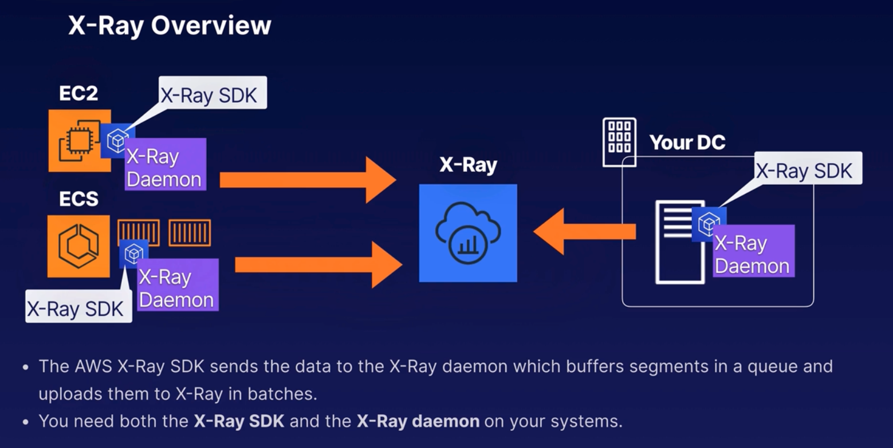

### X-Ray Configuration Steps

#### High Level Configuration Steps:

Requirements for configuration:

- X-Ray SDK
- X-Ray Daemon

Use the SDK to instrunment your application to send the required data. E.g. data about incoming and outgoing HTTP requests that are being made to your Java app.

Configuration steps:

1. Installation:

- On-Premises and EC2 Instances: Install the X-Ray daemon on your EC2 instance or on-premises server.
- Elastic Beanstalk: Install the X-Ray daemon on your EC2 instances inside your Elastic Beanstalk environment.
- Elastic Container Service: Install the X-Ray daemon in its own Docker container on your ECS cluster alongside your app.

2. Annotations & Indexing:

- Annotations: When instrunmenting your application, you can record additional information about requests by using annotations.
  - Annotations are Key-value pairs that are indexed for use with filter expressions, so that you can search for traces that contain specific data and group related traces together in the console - game_name=TicTacToe, game_id=2645445842

### Exam Tips

- X-Ray integrates with many AWS Services like DynamoDB, Lambda, API Gateway, etc.
- You can also instrunment your own applications to send data to X-Ray.
- Apps can be running on EC2, Elastic Beanstalk, On-Premises Systems, and ECS (Elastic Container Service).
- For ECS, run the X-Ray daemon (demon) in its own Docker image, running alongside your own application.

> Instrunmentation - Instrumentation is the process of adding code to your application so you can understand its inner state. Instrumented applications measure what code is doing when it responds to active requests by collecting data such as metrics, events, logs, and traces (MELT).
